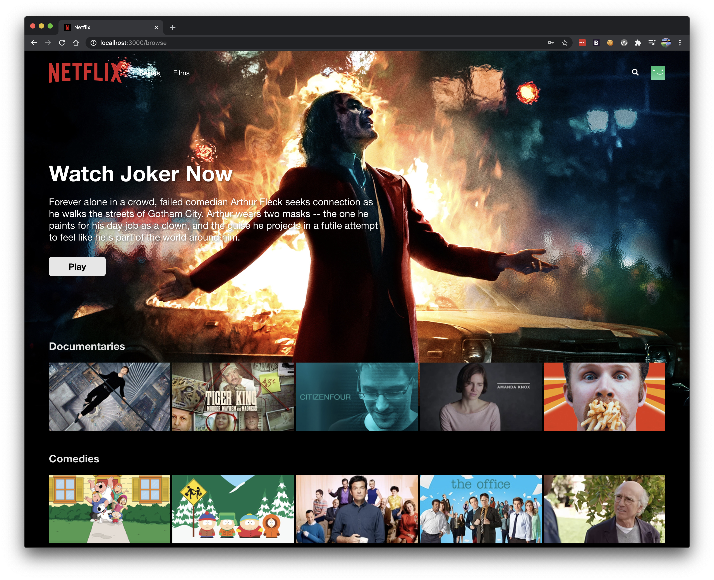

# Netflix Clone

A Netflix-inspired web app built with React, React Router, Firebase, and styled-components. The project includes the main landing page, sign-in and sign-up flows, profile selection, a browse experience, search, and a modal video player.

## What This Project Does

This app recreates the core flow of a streaming platform:

- Landing page with hero section, FAQ accordion, and email call-to-action
- Sign up and sign in screens
- Auth state handling with route protection
- Profile selection screen
- Browse screen with featured content, categories, search, and playback UI
- Modal video player for preview content
- Firebase-backed authentication and content loading patterns

## Tech Stack

- React 16
- React Router DOM 5
- Firebase 7
- styled-components
- Fuse.js for search
- normalize.css for base styling

## Project Structure

Key folders in `src/`:

- `app.js` - main route setup
- `index.js` - app bootstrap and Firebase context provider
- `components/` - reusable UI building blocks
- `containers/` - page-level sections and feature containers
- `pages/` - route screens like home, sign in, sign up, and browse
- `hooks/` - custom hooks for auth and content data
- `context/` - React context objects
- `helpers/` - route guards and helpers
- `lib/` - Firebase setup
- `fixtures/` - static data used by the UI
- `utils/` - shared utility functions

## Images

All static image assets live in [public/images](public/images). The app references them with `/images/...` URLs.

### Image Folders

- `public/images/misc` - hero backgrounds, loading assets, and general UI art
	- `home-bg.jpg`
	- `home-tv.jpg`
	- `home-mobile.jpg`
	- `home-imac.jpg`
	- `joker1.jpg`
	- `loading.gif`
	- `spinner.png`
- `public/images/icons` - UI icons used by buttons and controls
	- `add.png`
	- `chevron-right.png`
	- `close.png`
	- `close-slim.png`
	- `search.png`
- `public/images/users` - profile avatars
	- `1.png`
	- `2.png`
	- `3.png`
	- `4.png`
	- `5.png`
- `public/images/series` - series thumbnails grouped by category
	- `children/`
	- `comedies/`
	- `crime/`
	- `documentaries/`
	- `feel-good/`
- `public/images/films` - film thumbnails grouped by category
	- `children/`
	- `drama/`
	- `romance/`
	- `suspense/`
	- `thriller/`

### Common Image Paths Used By The App

- `/images/misc/home-bg.jpg` - landing page background
- `/images/misc/joker1.jpg` - browse hero background
- `/images/misc/loading.gif` - profile loading image
- `/images/icons/search.png` - header search icon
- `/images/icons/add.png` - FAQ accordion open icon
- `/images/icons/close.png` - card feature close icon
- `/images/users/{n}.png` - profile avatar images
- `/images/series/{category}/{slug}/small.jpg` - browse thumbnails for series
- `/images/films/{category}/{slug}/small.jpg` - browse thumbnails for films

## Getting Started

### 1. Install dependencies

```bash
npm install
```

### 2. Start the app

On this Windows setup, use:

```bash
npm start
```

The project script already sets the legacy OpenSSL flag needed by this older React/webpack stack.

If you run the project in another shell or OS and hit the OpenSSL error, use:

```bash
NODE_OPTIONS=--openssl-legacy-provider npm start
```

### 3. Open the app

The app should open at:

```text
http://localhost:3000
```

If port 3000 is already in use, Create React App may prompt for another port.

## Main Routes

- `/` - landing page
- `/signin` - sign in page
- `/signup` - sign up page
- `/browse` - authenticated browse experience

## Features

### Landing Page

- Large hero banner with marketing copy
- Email call-to-action form
- FAQ accordion
- Footer links

### Authentication

- Sign up and sign in forms
- Auth listener with local user persistence
- Redirects based on logged-in state

### Browse Experience

- Profile selection before entering the browse view
- Featured hero section
- Category switching between series and films
- Search using Fuse.js
- Content cards and feature modal
- Hero Play button that opens the preview player

### Video Player

- Modal overlay player
- Close control and video playback UI
- Built with React portals

## Firebase Note

The project uses Firebase patterns for auth and content loading. For local preview, the app includes a fallback so the UI still loads without real Firebase credentials.

If you want real authentication and content data, replace the placeholder Firebase config in `src/lib/firebase.prod.js` with your own Firebase project settings.

## Scripts

- `npm start` - run the development server
- `npm run build` - build for production
- `npm test` - run tests
- `npm eject` - eject from Create React App

## Notes

- The repo contains some existing lint warnings from the original project structure.
- The app is designed for local development and tutorial-style exploration, not production deployment as-is.

## Screenshots

### Browse Page



## Preview


